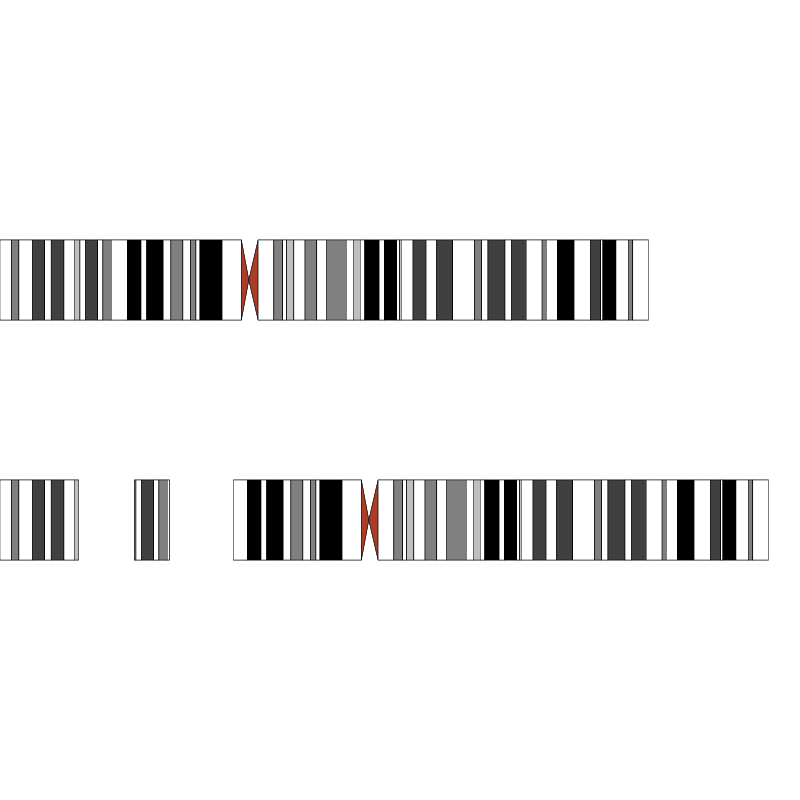
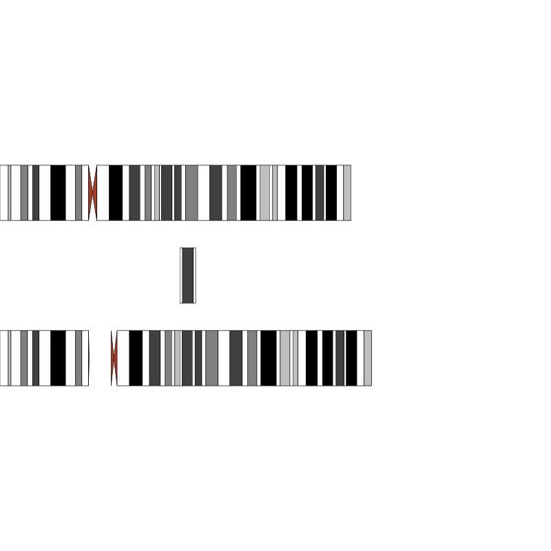

# grideogram
Drawing chromosome ideogram using R's grid graphics

## Install
```
install_github('cjyoon/grideogram')
```

## Examples
```
library(grideogram)
grid.newpage()
draw_ideogram('chr2', xpos = 0, ypos = 0.6)
draw_ideogram('chr2', 1, 29446361, xpos = 0, ypos = 0.3, adjust = F, inv = F, label_x_pos = 'left')
draw_ideogram('chr2', 29446670, 42550084, xpos = 0.07, ypos = 0.3, adjust = F, inv = F, label_x_pos = 'left')
draw_ideogram('chr2', 42549947, xpos = 0.15, ypos = 0.3, adjust = F, inv = F, label_x_pos = 'left')
```


```
grid.newpage()
draw_ideogram('chr4', xpos = 0, ypos = 0.6)
draw_ideogram('chr4', 1, 48491035, xpos = 0, ypos = 0.3, ref='grch38', adjust = F, inv = F, label_x_pos = 'left')
draw_ideogram('chr4', 48480062, xpos = 0.04, ypos = 0.3, ref='grch38', adjust = F, inv = F, label_x_pos = 'left')
draw_ideogram('chr4', 67988888, 76497277, xpos = 0.1, ypos = 0.45, ref='grch38', adjust = F, inv = F, label_x_pos = 'left')
```


